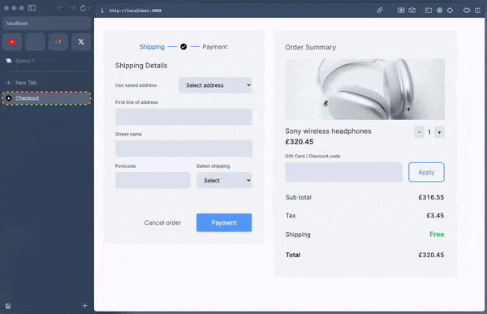

# Projeto de Backend e Frontend com Docker Compose

Este é um projeto que consiste em um backend Node.js e um frontend Next.js, ambos configurados para serem executados usando Docker Compose.

[](https://youtu.be/KrB1sx7gQR0)

Ansioso para ver funcionando em alta resolução? Acesse a [Demo no YouTube](https://youtu.be/KrB1sx7gQR0)

## Pré-requisitos

Antes de começar, certifique-se de ter o Docker e o Docker Compose instalados em sua máquina. Você pode encontrar instruções de instalação nos seguintes links:

- [Docker Install](https://docs.docker.com/get-docker/)
- [Docker Compose Install](https://docs.docker.com/compose/install/)

## Como executar

1. Clone este repositório para o seu ambiente local:

```bash
git clone https://github.com/lucasdu4rte/desafio-kirvano.git
```

2. Navegue até o diretório do projeto:

```bash
cd desafio-kirvano
```

3. Execute o comando Docker Compose para iniciar os serviços do backend e frontend:

```bash
docker-compose up
```

Isso irá construir as imagens Docker para o backend e frontend, e então iniciar os contêineres para ambos os serviços.

4. Após os contêineres estarem em execução, você poderá acessar o frontend em seu navegador utilizando o seguinte endereço:

```bash
http://localhost:3000
```

O backend estará disponível em:

```bash
http://localhost:3000
```

5. Para parar os serviços, pressione `Ctrl + C` no terminal onde o `docker-compose up` está sendo executado, ou execute o seguinte comando no mesmo diretório do arquivo `docker-compose.yml`:

```bash
docker-compose down
```

Isso irá parar e remover os contêineres, redes e volumes associados aos serviços.
